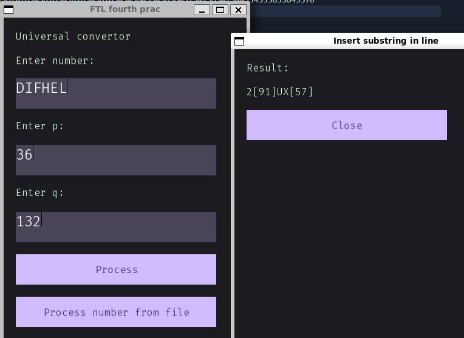

Number conversion workshop in FTL
## Terms of Reference

This workshop project focuses on implementing a number conversion system that supports the translation of numbers into various number bases, including the conversion of n-ary fractions, including periodic fractions, into a number system with a different base.

The project also features a custom implementation of the `BigInteger` and `BigFloat` classes. These classes utilize the Karatsuba algorithm and handle very large numbers without sacrificing precision.

Supports:
- letters (`A` stands for 10, `B` stands for 11 and so on)
- big digits (`[132]` stands for digit 132)
- periodic fractions (`0.123(456)`)
- parser supports radixes with `_` (`0.12_3` will be parsed in 3rd radix)
- exception-based logic - will throw `std::invalid_argument` or `InvalidNumberException` if something goes wrong

## Run
1. Clone the repo:
```bash
git clone https://github.com/difhel/ftl-number-conversion
```
2. Make sure you have SFML library installed
3. Build with cmake

## Screenshots


