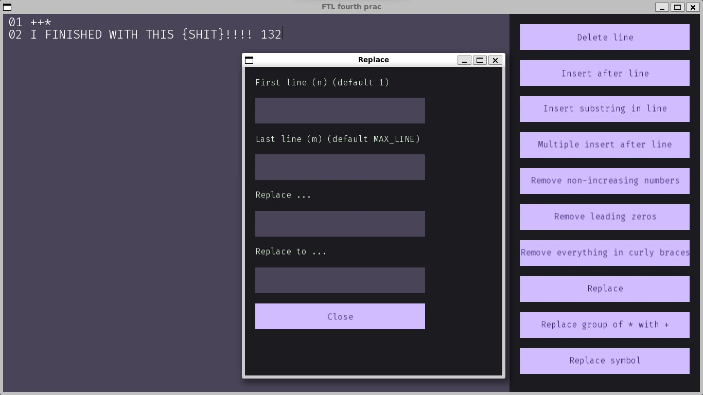

Text editor workshop in FTL
## Terms of Reference

"Text Editor" Workshop

Realize a simple line-by-line text editor. Use an array of pointers to lines as the internal representation (so that the lines themselves never move).
The program interface consists of a window that displays the current text and a set of buttons with commands. Long lines (those that do not fit in the main window) need to be written to memory as multiple lines.
When a command button is pressed, a separate window for entering command arguments may pop up.

### Commands for inserting lines:
* Insert one line after the Nth line (the line and N are entered). If N=0 is entered, insert at the beginning.
* Insert several lines starting from the N-th line.
* Deleting a line by the number N (lines are numbered from one).

### Simple string modification commands:
* Insert a substring into the Nth line, starting at the Mth position.
* Replace the M-th character in the N-th string.
* Context substitute substring for substring for a given range of text lines (defaults to all text).

### Algorithmic string processing commands:
* In a given range of strings, remove leading zeros from each group of consecutive digits. If a group of digits consists of zeros only, replace it with one zero. Do not change the remaining characters.
* Leave only those groups of consecutive digits in the string (at least two digits in a group), which are composed of digits with increasing values. Delete all other digits and groups of digits. Do not change the other characters.
* Replace each group of N adjacent characters * with a group of N/2 adjacent characters +. Do not change single asterisks.
* Delete groups of characters between curly braces from the specified string. The curly braces themselves are also deleted. For this task, the input is correct and simple - there are no other curly braces inside curly braces.

## Screenshots

